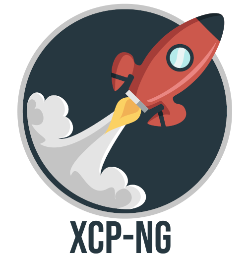
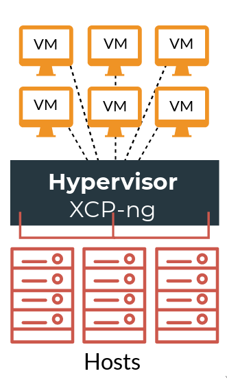

# XCP-ng: A turnkey open source virtualization platform

* [What is XCP-ng?](#what-is-xcp-ng)
  * [Genesis](#genesis)
  * [Key points](#key-points)
	
* [Documentation](#documentation)
* [Contribution & community](#contribution-and-community)
* [Pro support](#pro-support)

## What is XCP-ng?

XCP-ng is a virtualization platform based on **Xen Source** and **Citrix® Hypervisor** (formerly XenServer).
XCP-ng stands for **Xen Cloud Platform - New Generation** and is a *tribute* to the old Open Source project XCP, which was abandoned when XenServer was open-sourced in 2013. 

### Genesis

* 2003 : Xen project birth, first open source hypervisor
* 2007 : Xen Source Inc. acquired by Citrix, birth of XenServer (closed source) 
* 2010 : Citrix strategy focused on virtual desktop (XenApp/XenDesktop) instead of server virtualization
* 2011 : XCP 1.0 (Xen Cloud Platform, Open Source XenServer)
* 2013 : XenServer becomes Open (end of XCP). Birth of Xen Orchestra
* 2017 (Dec) : Citrix changes their pricing strategy regarding XenServer and removes essential features from free XenServer versions. New features developed are (mostly) no longer open source
* 2018 (Jan) : XenServer forked, birth of XCP-ng
* 2019 (Jul): XCP-ng 8.0 is released

### Key points

XCP-ng is a turnkey open source virtualization platform.

#### Platform

A combination of multiple components to deliver a cohesive solution

**Compute** + **Network** + **Storage** + **API** (Xen API) = **XCP-ng**

#### Open Source

XCP-ng is open source (mostly GPLv2), but also, all the components, documentation, repositories and dev process are publicly available and easily accessible. 

#### Turnkey

* XCP-ng is intended to be easy to download and easy to install
* We are aiming to have the largest possible hardware compatibility
* XCP-ng embeds a complete API and comes with a friendly web-UI: [Xen Orchestra](https://xen-orchestra.com/#!/xo-home)

### Documentation

We have extensive documentation for the XCP-ng project available [here](https://github.com/xcp-ng/xcp/wiki)

### Contribution and community

XCP-ng has a living community that you can join on our [forum](https://xcp-ng.org/forum/). 

The project is open to [contributions](https://github.com/xcp-ng/xcp/wiki/Development-process-tour), [bug reports](https://github.com/xcp-ng/xcp/wiki/How-to-report-bugs) and you can also [host a mirror](https://github.com/xcp-ng/xcp/wiki/Mirrors) for XCP-ng

### Pro support

For production environments and companies, we recommend obtaining pro support to cover your infrastructure. Pro support is delivered directly by the XCP-ng project dev team and pricing is per host, not per core! 

Learn more about pro support for XCP-ng on the [dedicated website](https://xcp-ng.com/). 
